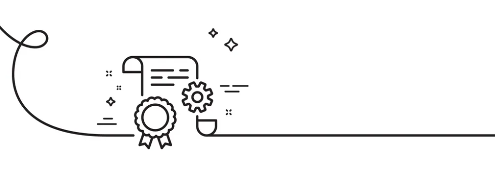

<a id="readme-top"></a>
<!--
*** Modified template from othneildrew on GitHub :)
*** https://github.com/othneildrew/Best-README-Template
-->

<!-- 
To avoid retyping too much information, do a search and replace with your text editor for the following: `github_username`, `repo_name`, `github_handle`, `linkedin_username`, `email_client`, `email`, `project_title`, `project_description`
-->

<!-- PROJECT SHIELDS -->
<!--
*** I'm using markdown "reference style" links for readability.
*** Reference links are enclosed in brackets [ ] instead of parentheses ( ).
*** See the bottom of this document for the declaration of the reference variables
*** for contributors-url, forks-url, etc. This is an optional, concise syntax you may use.
*** https://www.markdownguide.org/basic-syntax/#reference-style-links
-->
[![Contributors][contributors-shield]][contributors-url] [![Stargazers][stars-shield]][stars-url] [![Issues][issues-shield]][issues-url] [![MIT License][license-shield]][license-url]

<div align="center">

[![Nhi's LinkedIn][n-linkedin-shield]][nhi-linkedin-url] [![Jenny's LinkedIn][j-linkedin-shield]][jenny-linkedin-url] [![Victoria's LinkedIn][v-linkedin-shield]][vee-linkedin-url]

</div>


<!-- PROJECT LOGO -->
<br />
<div align="center">
  <a href="https://github.com/bunnhimaybe/DocumentationWorkshop">
    
  </a>

<h1 align="center">Documentation Workshop</h1>

  <p align="center">
    <strong>Pod 8:</strong> A workshop and supporting documents for creating and maintaining documentation.<br/>
    <a href="https://github.com/bunnhimaybe/DocumentationWorkshop"><strong>Explore the docs »</strong></a><br/>
    <a href="https://github.com/bunnhimaybe/DocumentationWorkshop">View Demo</a>
    ·
    <a href="https://github.com/bunnhimaybe/DocumentationWorkshop/issues/new?labels=bug&template=bug-report---.md">Report Bug</a>
    ·
    <a href="https://github.com/bunnhimaybe/DocumentationWorkshop/issues/new?labels=enhancement&template=feature-request---.md">Request Feature</a>
  </p>
</div>


<!-- TABLE OF CONTENTS -->
<details>
  <summary>Table of Contents</summary>
  <ol>
    <li>
      <a href="#about-the-project">About The Project</a>
      <ul>
        <li><a href="#built-with">Built With</a></li>
      </ul>
    </li>
    <li>
      <a href="#getting-started">Getting Started</a>
      <ul>
        <li><a href="#prerequisites">Prerequisites</a></li>
        <li><a href="#installation">Installation</a></li>
      </ul>
    </li>
    <li><a href="#usage">Usage</a></li>
    <li><a href="#roadmap">Roadmap</a></li>
    <li><a href="#contributing">Contributing</a></li>
    <li><a href="#license">License</a></li>
    <li><a href="#contact">Contact</a></li>
    <li><a href="#acknowledgments">Acknowledgments</a></li>
  </ol>
</details>


<div align="center">  <h4>Built With: </h4>

 [![Sphinx Button][Sphinx]][Sphinx-url] [![GitHub Button][GitHub]][Github-url] [![Discord Button][Discord]][Discord-url]
[![Markdown Button][Markdown.md]][Markdown-url] [![GitHub Pages Button][GitHubPages]][GitHubPages-url]
</div>
<p align="right">(<a href="#readme-top">back to top</a>)</p>
</div>


<!-- ABOUT THE PROJECT -->
## About The Project
[![Product Name Screen Shot][product-screenshot]](https://example.com)

This workshop and its supporting documents are for the University of New Orleans's *CSCI 4120/5120 Intro to Software Engineering*. The class, composed of 32 students, is working on one large project for the Computer Science Department and is split into "pods" of three people each.

Each pod is assigned a topic specialization that they are responsible for hosting a workshop on and providing support throughout the semester. Our pod was assigned **Documentation**, which means we are experts in...
* Auto-documentation with Sphinx
* Commit messages
* README files
* GitHub Pages
* GitHub Wikis
* Best practices for documentation

Our group presents Tuesday, September 24th, 2024. Our pod consists of Nhi, Jenny, and Victoria (more information listed below in <a href="#contact">Contact</a>).

<p align="right">(<a href="#readme-top">back to top</a>)</p>


<!-- GETTING STARTED -->
## Getting Started

To follow along with our workshop, install the prerequisites below and refer to our [Wiki](https://github.com/bunnhimaybe/DocumentationWorkshop/wiki) for each  topic.

### Prerequisites

#### READMEs: 
* **Visual Studio Code**

If you would like to use your terminal, feel free to; we decided to base our workshop based around VSCode as an attempt to build off of the IDE Pod's workshop.

#### Auto-docs
1. **GitHub** account; register [here](https://github.com/signup).
2. **Read the Docs** account; register [here](https://about.readthedocs.com/).
3. **Python**; to install:
   * *Ubuntu*: `sudo apt install python3`
   * *Linux*: `sudo pacman -S python`
   * *MacOSx*: `brew install python`, with [Homebrew](https://brew.sh/).
   * *Windows*: `choco install python`, with [Chocolatey](https://chocolatey.org/).

To see if you have Python installed correctly, check your python version with the command:
  ```sh
  python --version
  ```

#### Auto-docs Installation

1. Get a free API Key at [https://example.com](https://example.com)
2. Clone the repo
   ```sh
   git clone https://github.com/bunnhimaybe/DocumentationWorkshop.git
   ```
3. Install NPM packages
   ```sh
   npm install
   ```
4. Enter your API in `config.js`
   ```js
   const API_KEY = 'ENTER YOUR API';
   ```
5. Change git remote url to avoid accidental pushes to base project
   ```sh
   git remote set-url origin bunnhimaybe/DocumentationWorkshop
   git remote -v # confirm the changes
   ```

<p align="right">(<a href="#readme-top">back to top</a>)</p>


<!-- USAGE EXAMPLES -->
## Usage

<!-- Use this space to show useful examples of how a project can be used. Additional screenshots, code examples and demos work well in this space. You may also link to more resources.-->

For documentation examples, please refer to the [Documentation](https://github.com/bunnhimaybe/DocumentationWorkshop/wiki).

<p align="right">(<a href="#readme-top">back to top</a>)</p>


<!-- ROADMAP -->
## Roadmap

- [x] Workshop preparation
- [x] Workshop; September 24th, 2024
  - [ ] Student deliverables submitted
- [ ] Ongoing peer support via Discord

See the [open issues](https://github.com/bunnhimaybe/DocumentationWorkshop/issues) for a full list of proposed features (and known issues).

<p align="right">(<a href="#readme-top">back to top</a>)</p>


<!-- CONTRIBUTING -->
## Contributing

Contributions are what make the open source community such an amazing place to learn, inspire, and create. Any contributions you make are **greatly appreciated**.

If you have a suggestion that would make this better, please fork the repo and create a pull request. You can also simply open an issue with the tag "enhancement".
Don't forget to give the project a star! ♥

1. Fork the Project
2. Create your Feature Branch (`git checkout -b feature/AmazingFeature`)
3. Commit your Changes (`git commit -m 'Add some AmazingFeature'`)
4. Push to the Branch (`git push origin feature/AmazingFeature`)
5. Open a Pull Request

#### Top contributors:

<a href="https://github.com/bunnhimaybe/DocumentationWorkshop/graphs/contributors">
  
</a>

<p align="right">(<a href="#readme-top">back to top</a>)</p>


<!-- CONTACT -->
## Contact

Nhi Pham - [@bunnhimaybe](https://github.com/bunnhimaybe) - lapham@uno.edu  
Jenny Spicer - [@Jenspi](https://github.com/Jenspi) - jmspicer@uno.edu  
Victoria Pham - [@vplpham](https://github.com/vplpham) - vppham@uno.edu  

<strong>SWE Discord Invite: https://discord.gg/srMAfEGNn4</strong>
<strong>Project Link: [https://github.com/bunnhimaybe/DocumentationWorkshop](https://github.com/bunnhimaybe/DocumentationWorkshop)</strong>

<p align="right">(<a href="#readme-top">back to top</a>)</p>


<!-- ACKNOWLEDGMENTS -->
## Acknowledgments

Distributed under the MIT License. See `LICENSE.txt` for more information.

* [othneildrew's Best README Template](https://github.com/othneildrew/Best-README-Template)
* [Markdown Syntax](https://www.markdownguide.org/basic-syntax/)
* [shields.io Badge Maker](https://shields.io/badges)

<p align="right">(<a href="#readme-top">back to top</a>)</p>


<!-- MARKDOWN LINKS & IMAGES -->
<!-- https://www.markdownguide.org/basic-syntax/#reference-style-links 
*** Badge maker: https://shields.io/badges
*** Icons: https://simpleicons.org/
*** Slug labels: https://github.com/simple-icons/simple-icons/blob/master/slugs.md
-->

<!-- README helpers -->
[test-shield]: https://img.shields.io/badge/example%20label-black?style=for-the-badge&logo=github
[test-url]: https://www.github.com/
[product-screenshot]: images/screenshot.png

<!-- GitHub Stats-->
[contributors-shield]: https://img.shields.io/github/contributors/bunnhimaybe/DocumentationWorkshop.svg?style=for-the-badge
[contributors-url]: https://github.com/bunnhimaybe/DocumentationWorkshop/graphs/contributors
[forks-shield]: https://img.shields.io/github/forks/bunnhimaybe/DocumentationWorkshop.svg?style=for-the-badge
[forks-url]: https://github.com/bunnhimaybe/DocumentationWorkshop/network/members
[stars-shield]: https://img.shields.io/github/stars/bunnhimaybe/DocumentationWorkshop.svg?style=for-the-badge
[stars-url]: https://github.com/bunnhimaybe/DocumentationWorkshop/stargazers
[issues-shield]: https://img.shields.io/github/issues/bunnhimaybe/DocumentationWorkshop.svg?style=for-the-badge
[issues-url]: https://github.com/bunnhimaybe/DocumentationWorkshop/issues
[license-shield]: https://img.shields.io/github/license/bunnhimaybe/DocumentationWorkshop.svg?style=for-the-badge
[license-url]: https://github.com/bunnhimaybe/DocumentationWorkshop/blob/master/LICENSE.txt

<!-- Personal -->
[n-linkedin-shield]: https://img.shields.io/badge/Nhi's%20linkedin-black?style=for-the-badge&logo=linkedin&labelColor=%230077B5&color=%230077B5
[j-linkedin-shield]: https://img.shields.io/badge/Jenny's%20linkedin-black?style=for-the-badge&logo=linkedin&labelColor=%230077B5&color=%230077B5
[v-linkedin-shield]: https://img.shields.io/badge/Victoria's%20linkedin-black?style=for-the-badge&logo=linkedin&labelColor=%230077B5&color=%230077B5
[nhi-linkedin-url]: https://linkedin.com/in/lisanapham
[jenny-linkedin-url]: https://linkedin.com/in/Jenspi
[vee-linkedin-url]: https://linkedin.com/in/actuallyvee

<!-- Badges -->
[Next.js]: https://img.shields.io/badge/next.js-000000?style=for-the-badge&logo=nextdotjs&logoColor=white
[Next-url]: https://nextjs.org/
[React.js]: https://img.shields.io/badge/React-20232A?style=for-the-badge&logo=react&logoColor=61DAFB
[React-url]: https://reactjs.org/
[Sphinx]: https://img.shields.io/badge/sphinx-0a507a?style=for-the-badge&logo=sphinx
[Sphinx-url]: https://www.sphinx-doc.org/en/master/#
[Markdown.md]: https://img.shields.io/badge/markdown-black?style=for-the-badge&logo=markdown&labelColor=%231ca3e1&color=%231ca3e1
[Markdown-url]: https://www.markdownguide.org/
[GitHub]: https://img.shields.io/badge/github-black?style=for-the-badge&logo=github
[GitHub-url]: https://www.github.com/
[GithubPages]: https://img.shields.io/badge/githubpages-black?style=for-the-badge&logo=githubpages
[GitHubPages-url]: https://pages.github.com/
[Discord]: https://img.shields.io/badge/discord-%235460eb?style=for-the-badge&logo=discord&logoColor=white
[Discord-url]: https://www.discord.com/
